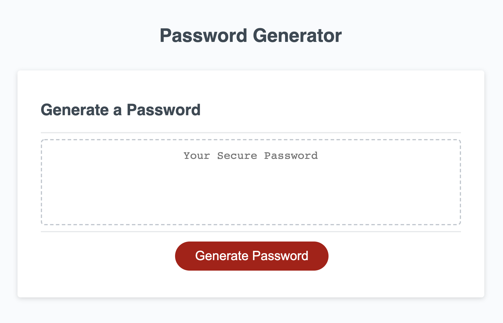

# 03-Random-Password-Generator

## Description

This application is intended to generate a random password for users based on their selection of password length and types of characters they want included. Given the importance of security in the digital world, this application helps users keep their accounts safe with a unique, strong password. 

On a more personal level, I created this applicaton to test my knowledge of Java Script and learn from the challanges faced while writing the code. The biggest challange I faced would be understanding the hierarchy of code in Java Script and how to generate a random set of characters that responds to the selecton of user preferences. Using school and outside resources, I was capable of understanding and implementing these concepts. In a bigger picture, I reinforced the concept of using your resouces when coding becuase it is one of your most valuable tools.

I beleive what makes my project stand out is the consice, short code I was able to create to complete such an operation. To view the deployed application, please [Click Here](https://glchavez.github.io/03-Random-Password-Generator/).

## Usage

To start the random password generator, you would first click on the "Generate Password" button. This will ask you to enter a password length between 8 and 128 characters. If a number outside of this range is selected, you will be given an error message, which then restarts the process.

If a password length between this range is selected, it will then ask you if you'd like your password to include numbers, lowercase characters, uppercase characters, and special characters. Once these preferences have been selected, a random password fittng the criteria will be generated on the screen.

To restart the application for a new password, simply click the "Generate Password" button again.

## Credits

I would like to provide credit to [The Denver Univeristy Coding Bootcamp](https://bootcamp.du.edu/coding/) for providing me with the materials, intstructions, and one-on-one assistance to perform this project.

Recognition is also provided to [W3Schools](https://www.w3schools.com/) for providing me with resources to better understand Java Script concepts and how to implement them and [Que Tran](https://codepen.io/Que_Tran000/pen/zbNYRQ) on CodePen for providing me with example Java Script code to better understand how to format different functions so that they operate correctly with one another to generate a password.

## License

MIT License

Copyright &copy; 2021 Giovany Chavez

Permission is hereby granted, free of charge, to any person obtaining a copy
of this software and associated documentation files (the "Software"), to deal
in the Software without restriction, including without limitation the rights
to use, copy, modify, merge, publish, distribute, sublicense, and/or sell
copies of the Software, and to permit persons to whom the Software is
furnished to do so, subject to the following conditions:

The above copyright notice and this permission notice shall be included in all
copies or substantial portions of the Software.

THE SOFTWARE IS PROVIDED "AS IS", WITHOUT WARRANTY OF ANY KIND, EXPRESS OR
IMPLIED, INCLUDING BUT NOT LIMITED TO THE WARRANTIES OF MERCHANTABILITY,
FITNESS FOR A PARTICULAR PURPOSE AND NONINFRINGEMENT. IN NO EVENT SHALL THE
AUTHORS OR COPYRIGHT HOLDERS BE LIABLE FOR ANY CLAIM, DAMAGES OR OTHER
LIABILITY, WHETHER IN AN ACTION OF CONTRACT, TORT OR OTHERWISE, ARISING FROM,
OUT OF OR IN CONNECTION WITH THE SOFTWARE OR THE USE OR OTHER DEALINGS IN THE
SOFTWARE.